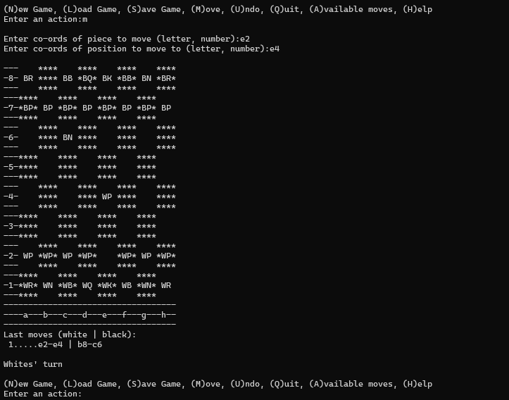
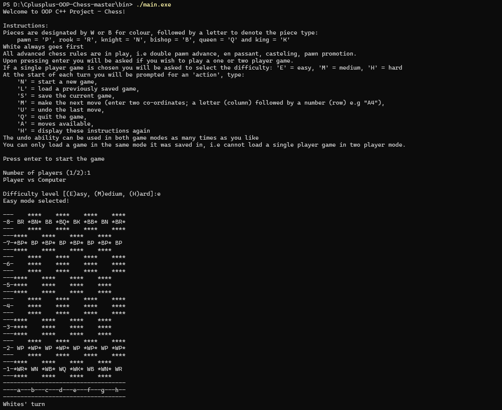

# C++ OOPs Chess

## Steps to run on your local system

1. Download the files from the repository, and extract all the files.
2. Open a terminal in the **bin** folder.
3. type **main.exe** in the terminal
4. Enjoy 🙂🙂

